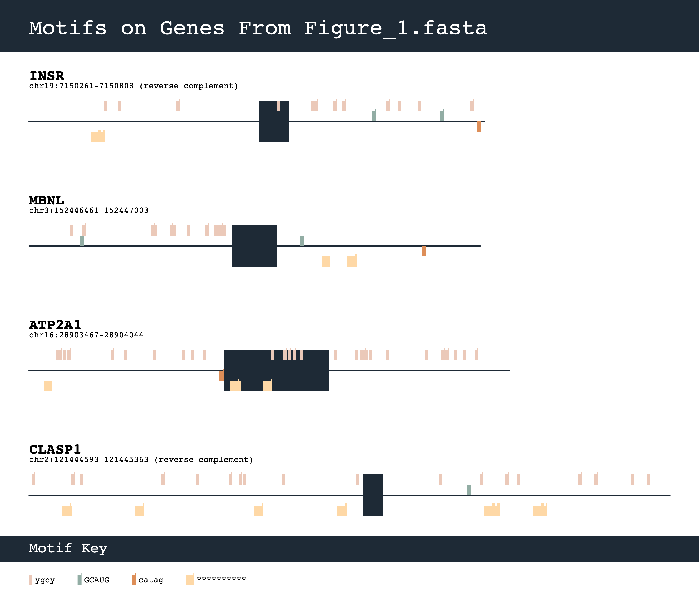

# motif-mark
motif-mark is a Python script that utilizes object-oriented programming to visualize motifs on gene sequences. It produces a figure that looks something like this: <br><br>


## Requirements
Running motif-mark requires Python 3.10+ and the installation of `pycairo`, which can be installed in a conda environment by running the following code:
```
conda install -c conda-forge pycairo
```

## Usage
Ensure the script is executable, then run it from the command line:
```
./motif-mark-oop.py -f <input_fasta_file> -m <motifs_file>
```

## Input
motif-mark takes in 2 input filepaths:

#### ```-f``` | ```-fasta```
- Properly formatted FASTA file, where each gene entry contains a header line beginning with `>`, followed by the gene name, then 1 or more sequence lines
- Sequences may be DNA (A, C, T, G) or RNA (A, C, U, G) and can contain Ns
- Each gene must be an exon-intron-exon gene (no other configurations can be handled), with intron sequences lowercase and exon sequences uppercase

#### ```-m``` | ```-motif```
- A `.txt` file with each motif on its own line
- Motif sequences may be DNA (A, C, T, G) or RNA (A, C, U, G) and can contain the following degenerate bases: T, U, R, Y, N
    - motif-mark can account for degenerate bases: i.e. the motif `AYC` will match `ACC` or `ATC` from a gene
- The orientation of the motif must match the orientation of the gene sequence (both must come from the same strand)
- A maximum of 5 motifs can be visualized at once, hence this file should be no longer than 5 lines

## Output
motif-mark produces 2 output files:

#### ```<input_fasta_file_prefix>.png```
- Example: [Figure_1.png](./example/Figure_1.png)
- All sequences are drawn to scale
- Each gene is displayed under its corresponding header, with the 2 introns denoted as lines and the exon denoted as a box
- Each motif is displayed in a different color and has a track along each gene, with the key at the bottom indicating motif identity
- Tick marks protruding from the tops of motif boxes (visible when image is zoomed in) indicate the end point of the motif, and are useful to identify overlapping motifs

#### ```<input_fasta_file_prefix>_stats.md```
- Example: [Figure_1_stats.md](./example/Figure_1_stats.md)
- A Markdown table with genes as rows and motifs as columns, containing counts of each motif's occurrences within each gene


